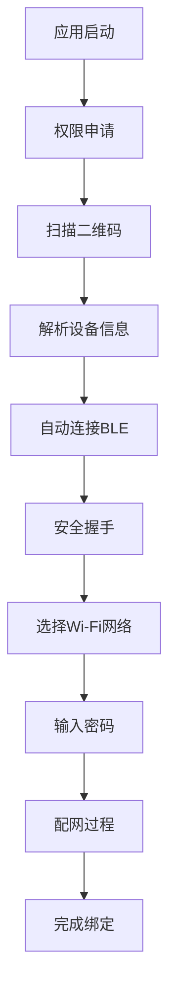

# VznGPT (心显智联)

🎯 **智能显示器配网手机应用** - 基于Flutter开发的跨平台配网应用，通过BLE和二维码技术为无输入智能显示器提供安全的Wi-Fi配置功能。

## 📋 项目概述

### 核心功能
- 📱 **二维码扫描** - 扫描显示器屏幕获取设备信息
- 🔗 **智能连接** - 自动连接对应的BLE设备  
- 🔐 **安全通信** - X25519 ECDH + AES-GCM端到端加密
- 📡 **网络配置** - 安全传输Wi-Fi凭据并实时监控配网状态
- 🛠️ **设备管理** - 设备绑定、命名和状态监控

### 技术架构
- **前端**: Flutter 3.16+ (iOS/Android)
- **通信**: BLE GATT服务
- **加密**: X25519 ECDH密钥交换 + AES-256-GCM
- **测试**: 真实BLE设备

## 🚀 快速开始

### 环境要求
- Flutter 3.16.7+
- Dart 3.2.4+
- iOS 13.0+ / Android 8.0+
- Xcode 15.0+ / Android Studio 2023.1+

### 安装依赖
```bash
flutter pub get
```

### 运行应用
```bash
# iOS
flutter run -d ios

# Android  
flutter run -d android
```

### 测试
```bash
# 单元测试
flutter test

# 集成测试
flutter test integration_test/
```

## 📚 项目文档

### 核心文档
- **[产品规格文档](docs/product-specification.md)** - 完整的产品功能规格、技术实现和开发计划
- **[技术方案概述](docs/tech-solution.md)** - BLE配网技术方案总体介绍  
- **[技术方案详细版](docs/tech-solution-details-1.0.md)** - 详细的技术实现方案和协议设计

### 文档导览

| 文档 | 描述 | 适用人群 |
|------|------|----------|
| [产品规格文档](docs/product-specification.md) | 🎯 **完整产品规格** - 功能定义、技术架构、开发计划、测试方案 | 项目经理、开发团队、测试团队 |
| [技术方案概述](docs/tech-solution.md) | 💡 **技术方案精要** - BLE配网核心技术和流程介绍 | 技术负责人、架构师 |
| [技术方案详细版](docs/tech-solution-details-1.0.md) | 🔧 **实现细节** - 协议设计、安全方案、生产部署 | 开发工程师、安全工程师 |

## 🏗️ 项目结构

```
SmartDisplayMobile/
├── lib/                    # Flutter应用源码
│   ├── main.dart          # 应用入口
│   ├── core/              # 核心工具和常量
│   ├── data/              # 数据层（API、本地存储）
│   ├── domain/            # 业务逻辑层
│   ├── presentation/      # UI展示层
│   └── services/          # 服务层（BLE、加密、二维码）
├── test/                  # 单元测试
├── integration_test/      # 集成测试
├── docs/                  # 项目文档
├── android/               # Android平台代码
├── ios/                   # iOS平台代码
└── README.md             # 项目说明
```

## 🔧 核心依赖

```yaml
dependencies:
  flutter_reactive_ble: ^5.3.1      # BLE通信
  mobile_scanner: ^3.5.6            # 二维码扫描
  cryptography: ^2.5.0              # 加密算法
  flutter_secure_storage: ^9.0.0    # 安全存储
  riverpod: ^2.4.9                  # 状态管理
  go_router: ^12.1.3                # 路由管理
```

## 📋 开发计划

| 阶段 | 时间 | 主要任务 | 状态 |
|------|------|----------|------|
| Phase 1 | Week 1-2 | 基础架构搭建 | 🟡 进行中 |
| Phase 2 | Week 3-4 | 核心功能开发 | ⏳ 待开始 |
| Phase 3 | Week 5-6 | 配网流程实现 | ⏳ 待开始 |
| Phase 4 | Week 7-8 | 测试和优化 | ⏳ 待开始 |
| Phase 5 | Week 9-10 | 发布准备 | ⏳ 待开始 |

## 🔄 用户流程



## 🛡️ 安全特性

- **🔐 端到端加密** - X25519 ECDH密钥交换 + AES-256-GCM加密
- **🔑 公钥验证** - 基于设备出厂公钥的身份验证
- **🚫 零明文存储** - Wi-Fi密码等敏感信息不落盘
- **⏰ 会话管理** - 密钥仅存储在内存中，及时清理

## 🧪 测试方案

### BLE设备测试
项目支持与真实BLE设备进行测试：
- 连接实际的智能显示器BLE GATT服务
- 扫描设备显示的二维码
- 完整的加密握手和配网流程

### 测试覆盖
- ✅ 单元测试：加密、数据解析、状态管理
- ✅ 集成测试：BLE通信、配网流程
- ✅ 端到端测试：完整用户流程验证
- ✅ 兼容性测试：多设备多系统验证

## 🧭 日志与崩溃监控（Sentry）

项目已集成 Sentry（Flutter SDK），默认从编译参数读取 DSN 与环境：

- 入口初始化：`lib/main.dart:1`
- 路由导航监控：`lib/core/router/app_router.dart:1`

运行/构建时通过 `--dart-define` 传入环境变量：

- `SENTRY_DSN`：你的 Sentry DSN
- `SENTRY_ENV`：环境名（如 `development` / `staging` / `production`）。未设置时，调试构建为 `development`，发布构建为 `production`。

示例命令：

- Android 调试：
  `flutter run -d android --dart-define=SENTRY_DSN=你的DSN --dart-define=SENTRY_ENV=development`

- iOS 调试：
  `flutter run -d ios --dart-define=SENTRY_DSN=你的DSN --dart-define=SENTRY_ENV=development`

- Android Release 构建：
  `flutter build apk --release --dart-define=SENTRY_DSN=你的DSN --dart-define=SENTRY_ENV=production`

- iOS Release 构建：
  `flutter build ipa --release --dart-define=SENTRY_DSN=你的DSN --dart-define=SENTRY_ENV=production`

SDK 配置要点：

- 在 `lib/main.dart:1` 中使用 `SentryFlutter.init` 初始化，开启了会话跟踪与部分性能采样（可按需调整采样率）。
- 在 `lib/core/router/app_router.dart:1` 中通过 `SentryNavigatorObserver` 采集导航面包屑与性能数据。
- 登录成功后会将 Supabase 用户写入 Sentry Scope（仅包含 id/email），退出登录时清空。

可选增强（建议后续配置）：

- Android 原生崩溃与符号表上传：已集成 `io.sentry.android.gradle` 插件，release 构建将自动上传 mapping/native 符号。
- iOS 原生崩溃与符号表上传：已提供上传脚本（`ios/scripts/upload-symbols.sh`），在 Xcode 添加一个 Run Script Phase 即可自动上传 dSYM。
- Web Source Map 上传：使用 `sentry_dart_plugin` 在构建后上传 source maps（按需）。

### 原生符号自动上传配置

所需凭据（CI 环境变量，推荐）：

- `SENTRY_AUTH_TOKEN`：Sentry Auth Token（需有 `project:releases` 权限）
- `SENTRY_ORG`：组织 slug
- `SENTRY_PROJECT`：项目 slug

也可以在根目录放置 `sentry.properties`（示例见 `sentry.properties.example`），但不建议提交包含密钥的文件到版本库。

#### Android（已就绪）

- 已在 `android/build.gradle` 注入插件类路径，并在 `android/app/build.gradle` 应用插件与默认配置：
  - 自动上传 release 的 ProGuard/R8 `mapping.txt`（若启用混淆）
  - 忽略 debug 构建
  - 依赖 `SENTRY_AUTH_TOKEN`/`SENTRY_ORG`/`SENTRY_PROJECT` 或 `sentry.properties`
- 如需生成 `mapping.txt`，可在 `android/app/build.gradle` 的 `release` 中启用：
  - `minifyEnabled true` 与（可选）`shrinkResources true`

构建示例（CI）：

```
export SENTRY_AUTH_TOKEN=***
export SENTRY_ORG=your-org
export SENTRY_PROJECT=your-project
flutter build apk --release
```

#### iOS（添加一次 Xcode 脚本）

- 已提供脚本：`ios/scripts/upload-symbols.sh`（调用 CocoaPods 的 `${PODS_ROOT}/Sentry/upload-symbols`）
- 在 Xcode 中为 Runner target 新增一个 Run Script Phase（建议放在 `[CP] Embed Pods Frameworks` 之后）：
  - Script 内容：`"${SRCROOT}/scripts/upload-symbols.sh"`
  - 输入环境变量：`SENTRY_AUTH_TOKEN`、`SENTRY_ORG`、`SENTRY_PROJECT`

归档/构建时会自动上传当前构建的 dSYM 到 Sentry。

如需我帮你完成原生侧符号化与 CI/CD 上传脚本配置，请告知打包流程（本地/Xcode/Gradle/CI）。

## 📞 支持与反馈

- **🐛 问题反馈** - [GitHub Issues](https://github.com/sihai-org/SmartDisplayMobile/issues)
- **📖 技术文档** - 参见 [docs/](docs/) 目录
- **💡 功能建议** - 通过Issue提交功能请求

## 📄 许可证

本项目采用 MIT 许可证 - 详见 [LICENSE](LICENSE) 文件

---

**开发团队**: Sihai Organization  
**最后更新**: 2025-01-08  
**版本**: 1.0.0

## 🌐 本地化使用约定（重要）

- 在 `MaterialApp.router` 注册生成的本地化委托与语言：
  - `localizationsDelegates: AppLocalizations.localizationsDelegates`
  - `supportedLocales: AppLocalizations.supportedLocales`
- UI 页面统一通过 `context.l10n` 获取文案（见 `lib/core/l10n/l10n_extensions.dart`）。
  - 若框架在极端时序下未就绪，会自动回退到英文，并且仅在首次回退时打印一条 SEVERE 日志：
    - name: `l10n`，level: `1000`，message: `AppLocalizations not ready in this BuildContext; using English fallback.`
  - 禁止对 `AppLocalizations.of(context)` 使用 `!` 非空断言。
- 依赖 `context` 的跳转放到 `WidgetsBinding.instance.addPostFrameCallback`，避免 `initState` 时序问题。
- 避免以循环“忙等”框架或本地化就绪；如需占位，使用安全兜底。
